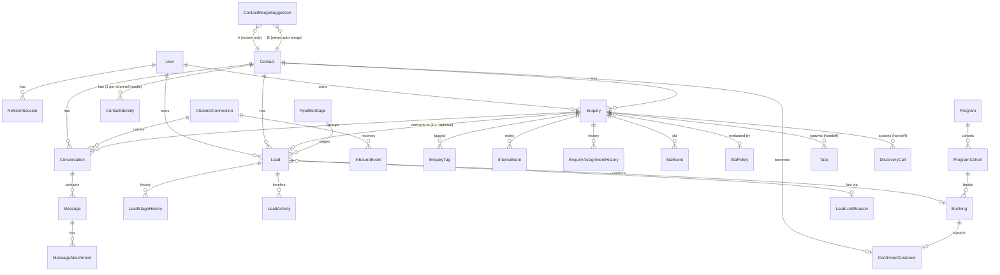

# Data model (ERD)

Core relationships (full schema in `prisma/schema.prisma`; 35 tables total).



## Lifecycle

```
Inbound message ──(InboundEvent, idempotent)──▶ Conversation + Message
        │
        ▼
     Enquiry  ──(convert, transactional, requires owner+next-action+date)──▶ Lead
        │                                                                      │
   triage/route/SLA                                              pipeline stages (10)
                                                                               │
                                                              confirm-booking ─▶ Booking ─▶ ConfirmedCustomer
```

## Key invariants (DB-level)

- `ContactIdentity (channel, normalizedHandle)` unique → safe auto-link only.
- `InboundEvent (connectionId, externalEventId)` and `(connectionId, externalMessageId)` unique → idempotent ingestion.
- `Enquiry.leadId` unique → an enquiry maps to at most one lead.
- `SlaEvent (enquiryId, type)` unique → idempotent SLA escalations.
- `Booking.leadId` / `ConfirmedCustomer.bookingId` unique → one booking per lead.
- Money: `expectedValueAmount` (Int, minor units) + `expectedValueCurrency` (enum) — never combined across currencies.
- All `DateTime` are UTC.
